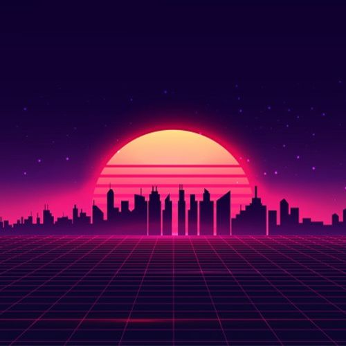
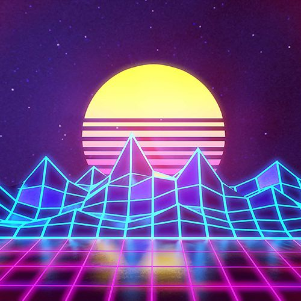
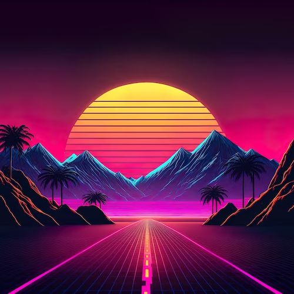
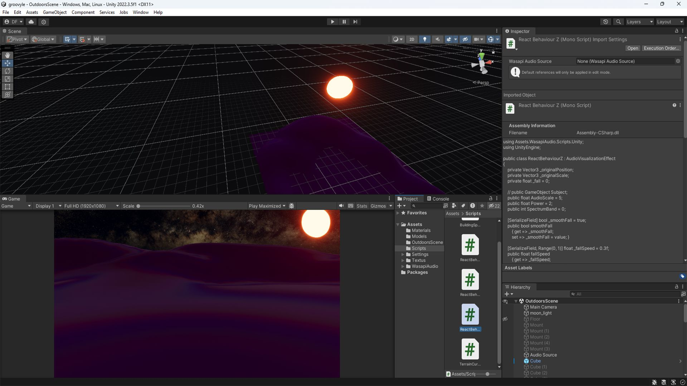

# <!---fit---> Groovyle :sunrise_over_mountains:
## Conceito Final
PSI3572 - Computação Visual (2024)
04/12/2024

---
# Equipe <i class="fas fa-users pink"></i>
- Vinícius Shimizu
- Diogo Ribeiro
- Jihee Song
- Guilherme Bozi

---
# Ideia <i class="fas fa-lightbulb redish"></i>

Inspirado na estética do gênero **Synthwave**, o projeto **Groovyle** é um **visualizador de áudio** que busca criar uma experiência imersiva e relaxante para o usuário.

O cenário noturno consiste em um campo com prédios que surgem, reagindo ao áudio capturado no dispositivo.

A ideia é que o usuário possa relaxar e se divertir com a interação entre a música e a cena.

---
# Referências <i class="fas fa-palette orange"></i>
  

---
# Modelagem <i class="fas fa-cubes red"></i>

---
# Construção da Cena <i class="fab fa-unity wine"></i>

---
# Implementação <i class="fab fa-unity redish"></i>

---
# Conclusão <i class="far fa-file orange"></i>
