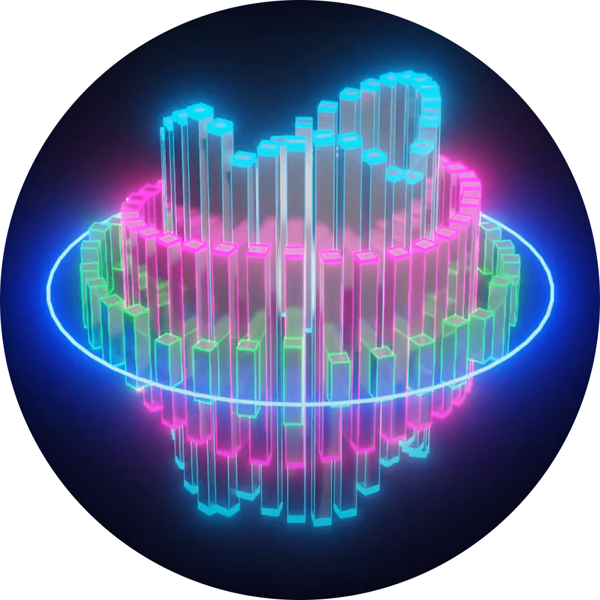
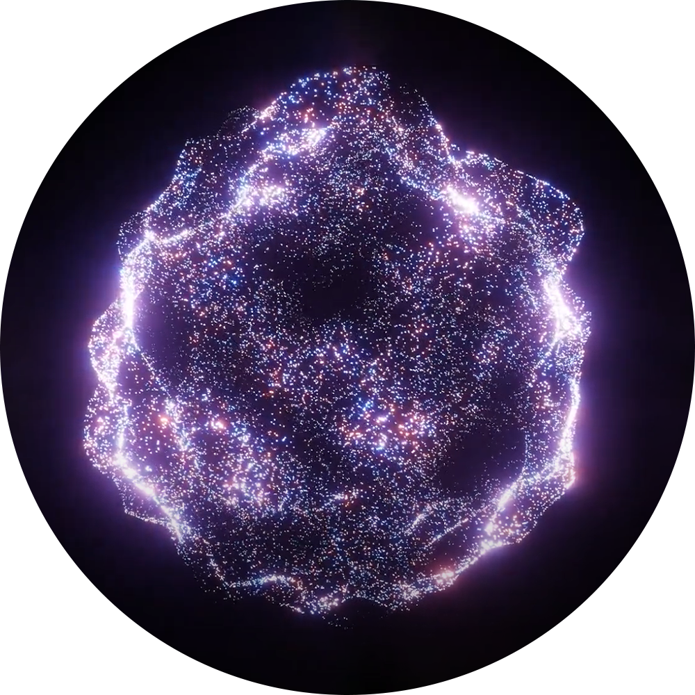
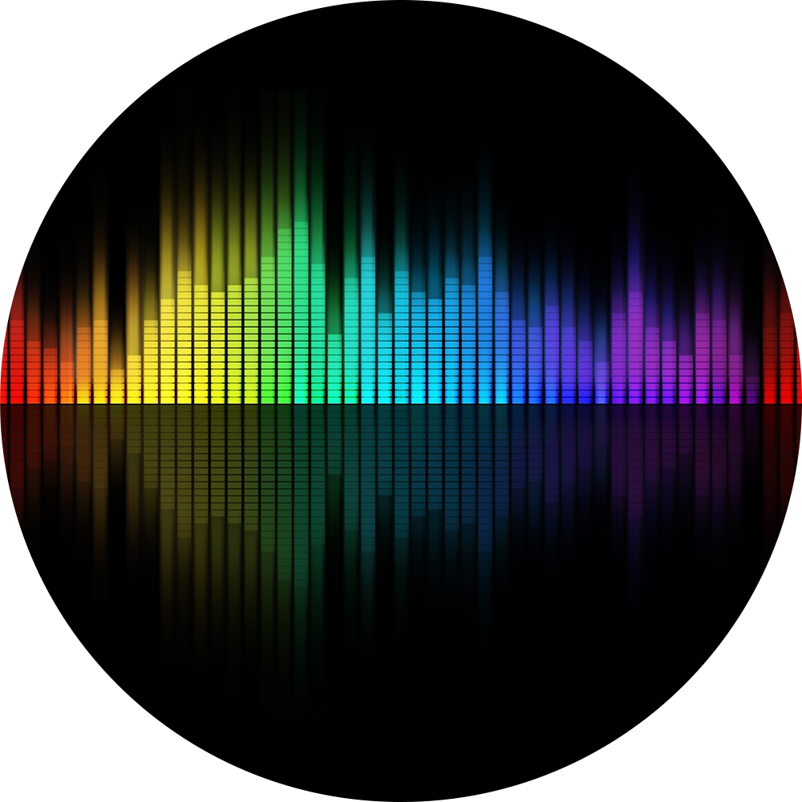
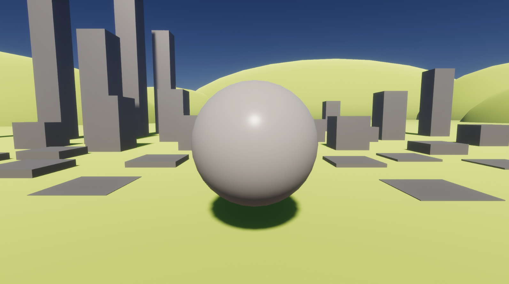

# <!---fit---> Groovyle :sunrise_over_mountains:
## Apresentação do projeto
PSI3572 - Computação Visual (2024)
23/10/2024

---
# Equipe :paperclip:
- Vinícius Shimizu
- Diogo Ribeiro
- Jihee Song
- Guilherme Bozi

---
# Ideia :bulb:

Aplicação para visualização 3D de espectro de áudio.

Um campo pacífico e silencioso irá se transformar conforme o áudio é capturado, dando lugar a uma cidade vibrante e cheia de energia. 

---
# Referências :art:
  

---
# Conceito :pencil2:

---
# Ferramentas :hammer:
- **Unity** <i class="fab fa-unity green"></i> (desenvolvimento da aplicação e programação);
- **Blender** <i class="fa fa-blender green"></i> (tratamento dos modelos 3D);
- **Photoshop** <i class="fa fa-camera green"></i> (manipulação de imagens para texturas e icones);
- **GitHub** <i class="fab fa-github green"></i> (controle de versão e organização do projeto).

---
# Estrutura do projeto :construction:
- **Modelagem** e **texturização** dos objetos;
- **Montagem** da cena (iluminação, posição da câmera, posição dos objetos, etc);
- **Processamento** do áudio capturado;
- **Programação** da interação entre cena e áudio;
- **Pós-processamento** da cena.

---
# Cronograma :clipboard:
**Semana 1** <i class="fa-solid fa-list-check orange"></i>
Decisão dos modelos a serem utilizados, assim como a cena a ser apresentada.

**Semana 2** <i class="fas fa-cubes orange"></i>
Modelagem básica dos objetos.

**Semana 3** <i class="fa-solid fa-paintbrush orange"></i>
Detalhamento dos modelos, início da texturização e implementação na Unity.

**Semana 4** <i class="fa-solid fa-laptop-code orange"></i>
Refinamento da texturização e implementação na Unity.

**Semana 5** <i class="fa-solid fa-bug orange"></i>
Correção de bugs.